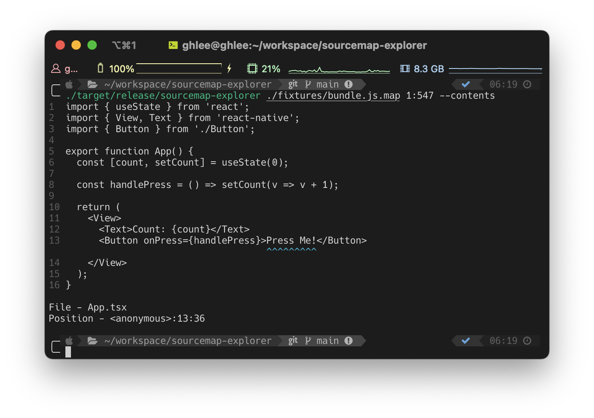

# sourcemap-explorer

Rust based sourcemap explorer for command-line interface.

## Features

- ⚡️ Light-weight & blazing fast
- 🗺️ Easy to reverse sourcemap mapping
- 🌱 Print original source content

## Installation

```bash
# Homebrew
brew tap leegeunhyeok/tap
brew install sourcemap-explorer

# Other platforms: TBD
```

## Usage

```bash
# Defualt
smx ./fixtures/bundle.js.map 1:549 --content
```

```
Sourcemap explorer

Usage: smx [OPTIONS] <SOURCEMAP> <POSITION>

Arguments:
  <SOURCEMAP>  Sourcemap file path
  <POSITION>   Position of the source code (eg. 1:549)

Options:
      --type <TYPE>  Type of runtime [default: default] [possible values: default, hermes]
      --content      Print the original source content
  -h, --help         Print help
  -V, --version      Print version
```



<details>
<summary>Hermes</summary>

```bash
./hermesc fixtures/bundle.hbc
```

```
Uncaught Error: Dynamic require of "react" is not supported
    at anonymous (address at bundle.hbc:1:233)
    at proxy trap (native)
    at anonymous (address at bundle.hbc:1:38)
    at global (address at bundle.hbc:1:9)
```

```bash
smx ./fixtures/bundle.hbc.map 1:233 --type hermes --content

# File - bundle.js
# Position - <anonymous>:11:15
```

```js
// `<anonymous>:11:15` in bundle.js
throw Error('Dynamic require of "' + x + '" is not supported');
```

</details>

## Development

```bash
# Run with fixtures
cargo run -- ./fixtures/bundle.js.map 1:549 --content

# build
./scripts/build.sh
```

## License

[BSD 3-Clause](./LICENSE)
