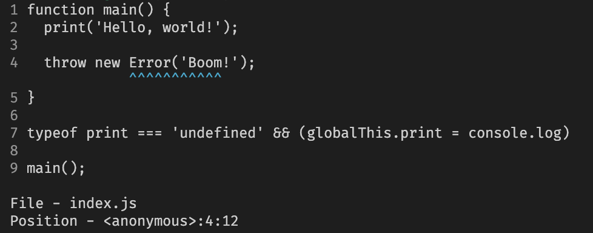

# sourcemap-explorer

Rust based sourcemap explorer for command-line interface.

## Features

- ⚡️ Light-weight & blazing fast
- 🗺️ Easy to reverse sourcemap mapping
- 🌱 Print original source content

## Installation

```bash
# Homebrew
brew tap leegeunhyeok/tap
brew install sourcemap-explorer

# Other platforms: TBD
```

## Usage

```bash
# Defualt
smx ./fixtures/bundle.js.map 5:19 --content

# Hermes
smx ./fixtures/bundle.hbc.map 1:95 \
  --type hermes \
  --hermes-packager-sourcemap ./fixtures/bundle.js.map \
  --content
```

```
Sourcemap explorer

Usage: smx [OPTIONS] <SOURCEMAP> <POSITION>

Arguments:
  <SOURCEMAP>  Sourcemap file path
  <POSITION>   Position of the source code (eg. 1:549)

Options:
      --type <TYPE>
          Type of runtime [default: default] [possible values: default, hermes]
      --hermes-packager-sourcemap <HERMES_PACKAGER_SOURCEMAP>
          If you use Hermes runtime (--type hermes),
          you need to provide the sourcemap file path of the packager (eg. Metro)
      --content
          Print the original source content
      --json
          Print the result in JSON format
  -h, --help
          Print help
  -V, --version
          Print version
```


<details>
<summary>Hermes</summary>

> This section is a guide to lookup packager sourcemap from Hermes bytecode sourcemap manually.

```bash
./hermesc ./fixtures/bundle.hbc
```

```
Hello, world!
Uncaught Error: Boom!
    at anonymous (address at ./fixtures/bundle.hbc:1:95)
    at global (address at ./fixtures/bundle.hbc:1:9)
```

```bash
smx ./fixtures/bundle.hbc.map 1:95

# File - ./fixtures/bundle.js
# Position - <anonymous>:5:19
```

```js
// `<anonymous>:5:19` in bundle.js
throw new Error('Boom!');
```

And you can find the original source code from `index.js`

```bash
smx ./fixtures/bundle.js.map 5:19 --content
```



</details>

## Development

```bash
# Run with fixtures
cargo run -- ./fixtures/bundle.js.map 1:549 --content

# build
./scripts/build.sh
```

## License

[BSD 3-Clause](./LICENSE)
